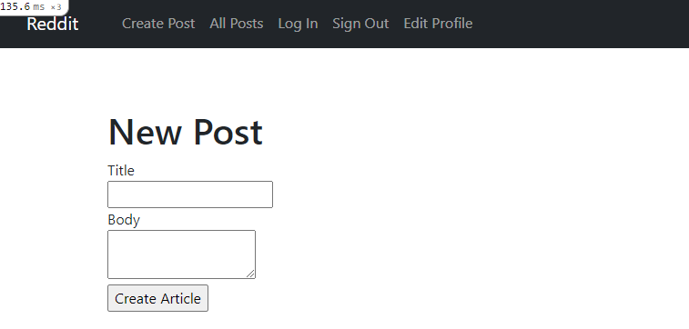

# Micro-Reddit

> This project, as the name implies, is a minimalist version of the popular Reddit website. On it you can create posts and commit on them ,also you can see all posts by clicking `All Posts`.

This project was built to demonstrate the understanding for Rails models and the associations between them

## Built With

- <code></code> Ruby Language  
-  <code></code> Ruby on Rails  
- &nbsp; Git 
- &nbsp; GitHub 
- &nbsp; VScode

## Getting Started

### Prerequisites
- Node
- Rails
- Yarn
- Git
- Node

### Setup

#### Clone this repository on to your local PC

- Click on the `Code` green button
- By the right end of the read-only input containing the repository link click the clipboard icon to copy the link
- In your local PC, open your terminal in the folder you would like to clone the repository into
- Clone the repository with the command: `git clone (copied link)`; like so: `git clone https://github.com/TedLivist/micro-reddit.git`
- After the clone, type in the command `cd micro-reddit` to access the directory on the terminal

### Usage

- Since this project is all about the representation of the associations between models - without html interface - model can be created and accessed through the `rails console`. Type `rails c` to access the console.
- Test run the following commands in sequence to make sure all is working fine.
  - Type `User.all` should return an empty array
  - Type `u = User.new(name: "Daniel")` to build new user. Then `u.save` to save
  - Type `p = User.first.posts.build` to build a post for the first user you have created.
  - Type `p.title = "my_first_post"` to assign title attribute to post. Then `p.save` to save
  - Type `c = Comment.new(title: "<title>", body: "<body>", user_id: <id>, post_id: <id>)` to create a comment with associated user and post

## Authors

👩🏻‍💼 **Zulfizar Abdumurodova**

- GitHub: [Abdumurodova Zulfizar](https://github.com/AbdumurodovaZulfizar)
- Twitter: [Abdumurodova Zulfizar](https://twitter.com/Zulfiza70357085)
- LinkedIn: [Abdumurodova Zulfizar](https://www.linkedin.com/in/zulfizar-abdumurodova-a61527206/)

## 🤝 Contributing

Contributions, issues, and feature requests are welcome!

Feel free to check the [issues page](../../issues/).

## Show your support

Give a ⭐️ if you like this project!

## Acknowledgments

- [Microverse](https://www.microverse.org/) for international opportunities.
- Special thanks to all code reviewers.
- AppAcademy and FreeCodeCamp for their open source

## 📝 License

Copyright 2021 Zulfizar Abdumurodova
- [MIT](https://github.com/AbdumurodovaZulfizar/ruby-linter/blob/build_linter/LICENSE.md) for this project.
